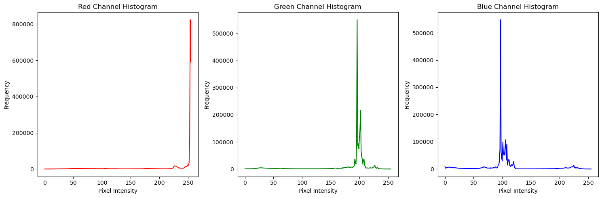

# TV Digital - TI0073

## Tarefa 1: Pesquisa sobre ITU-R BT.601 e Histogramas

### Objetivo
O objetivo desta tarefa é familiarizar-se com o padrão Rec. 601 (ITU-R BT.601) utilizado em sistemas de televisão de definição padrão (SDTV) e com as ferramentas de histograma.

### Instruções
1. **Pesquisa**: Pesquise sobre o padrão Rec. 601 (ITU-R BT.601) e familiarize-se com os seguintes aspectos:
    - O que é o Rec. 601 e qual é o seu propósito?
    - Quais são os principais componentes do Rec. 601?
    - Como o Rec. 601 define o espaço de cores e a estrutura de amostragem?
    - Quais são as especificações de quantização no Rec. 601?
    - Qual é a relação de aspecto definida pelo Rec. 601?
    - Em que contexto o Rec. 601 é amplamente utilizado e por que é importante?
  
2. **Histograma RGB**
    - Plotar histogram das 4 imagens do [Repositório](https://github.com/lucasabdalah/Courses-HWs/tree/master/PhD/TV_Digital/hw1);
    - Explicar como funciona o histogram;
    - Descrever por que o histograma da imagem apresenta o comportamento do gráfico obtido.

Exemplo:

1. **Formato**: Escreva um resumo conciso das suas descobertas sobre o Rec. 601, elencando fontes e destacando os pontos-chave e sua relevância. O plot das imagens e os respectivos histogramas pode ser enviado no mesmo PDF, ou em arquivo separado. (A implementação pode ser na linguagem de programação de sua preferência). 

2. **Entrega**: Envie seu resumo em formato de documento PDF para [lucas.abdalah@gtel.ufc.br](mailto:lucas.abdalah@gtel.ufc.br) até domingo, 17/03/2024 (23h59).

### Observações:
- Certifique-se de citar todas as fontes utilizadas na sua pesquisa.
- Se houver dúvidas, não hesite em entrar em contato para esclarecimentos.

Boa pesquisa!